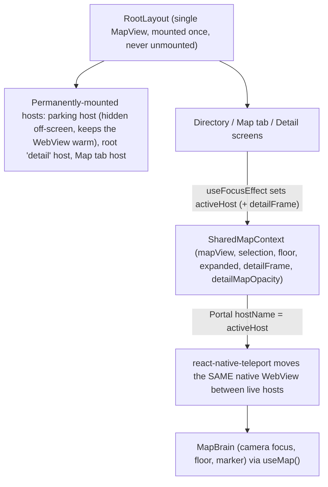
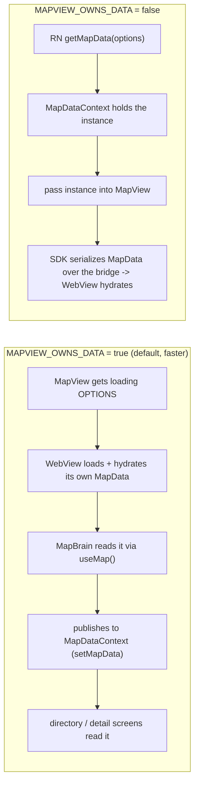

# Reusable MapView (Mappedin + Expo)

A reference Expo app showing how to **load a Mappedin `MapView` once and reuse the
same instance across every screen** instead of creating a fresh one per screen.
The single map is mounted once and physically reparented into whichever screen
needs it, so the underlying WebView boots and loads the venue data only once.

This sample accompanies the
[Optimizing User Interface Performance](https://developer.mappedin.com/react-native-sdk/getting-started#optimizing-user-interface-performance)
section of the Mappedin SDK for React Native Getting Started guide.

## The problem this solves

A Mappedin `MapView` renders inside a WebView. Every time you mount a new
`MapView`, that WebView has to boot, download the venue (MVF), and hydrate the
map data again. If each screen (directory, map tab, each location detail page)
mounts its own `MapView`, the user pays that initialization cost **on every
navigation** — which is exactly the "super long loading times" this demo fixes.

## The solution

Mount **one** `MapView` for the entire app lifetime and physically move that one
native view into whichever screen needs it, using
[`react-native-teleport`](https://github.com/kirillzyusko/react-native-teleport)
(true native reparenting on the New Architecture). The WebView boots **once** and
stays warm; navigating between screens just re-parents it.



- The `MapView` is created in [`app/_layout.tsx`](app/_layout.tsx) (`PersistentMap`) and never unmounted.
- It is wrapped in a teleport `<Portal>`. Its `hostName` is the **active host**, so the live WebView is reparented into whichever screen currently owns it.
- The map only ever moves between **permanently-mounted hosts** (the hidden off-screen `parking` host, the Map tab's host, and a single root-level `detail` host). No host is ever unmounted while it owns the map — see gotcha #6.
- Each screen "claims" the map in a `useFocusEffect` by setting `activeHost`, and releases it back to the hidden `parking` host on the way out.
- All shared state (the map control, floor list/selection, selected location, expanded flag, ready/focusing flags) lives in [`context/SharedMapContext.tsx`](context/SharedMapContext.tsx).
- [`components/MapBrain.tsx`](components/MapBrain.tsx) lives *inside* the `MapView` and drives it via `useMap()`: one-time setup, floor sync, tap-to-navigate, and camera/marker for the selected location.

### Front-loading (load before it's needed)

The map mounts at startup into an **off-screen** `parking` `PortalHost`, so the
WebView is fully warm before the user ever opens a detail page. With
`HIDE_MAP_TAB` on, there isn't even a visible map tab — the map still loads
upfront and is ready to reparent into a detail page instantly.

## Two data-loading paths (`MAPVIEW_OWNS_DATA`)

The venue data can be loaded in one of two ways, controlled by
`FLAGS.MAPVIEW_OWNS_DATA` in [`constants/flags.ts`](constants/flags.ts). Both are
verified to load the data exactly once per WebView session.



### `true` (default, recommended)

The MapView's WebView owns the load. We hand it the loading **options**
(`MAPPEDIN_OPTIONS`) and it loads + hydrates its own `MapData`. `MapBrain` then
reads that hydrated instance back out via `useMap()` and publishes it to
`MapDataContext` with `setMapData`, so the directory/detail screens read the
**same** instance.

Nothing is serialized across the React Native bridge into the WebView — which is
why this is faster. `RootNavigator` mounts the app tree immediately (the MapView
inside it is what loads the data) and covers it with the launch loader overlay.

### `false`

React Native loads the data natively with `getMapData(options)` in
[`context/MapDataContext.tsx`](context/MapDataContext.tsx) and passes the
resulting `MapData` instance into the `MapView`. The SDK then serializes that
parsed `MapData` over the bridge so the WebView can hydrate from it. Here
`RootNavigator` waits for the instance before mounting the tree, so everything
(including the MapView) mounts in a single commit.

Either way, `MapBrain` always works off `useMap().mapData` (the live hydrated
instance), so map operations are identical regardless of the flag.

## Feature flags ([`constants/flags.ts`](constants/flags.ts))

| Flag | Default | What it does |
| --- | --- | --- |
| `MAPVIEW_OWNS_DATA` | `true` | `true`: the WebView loads its own data (no `MapData` over the bridge, faster). `false`: load natively with `getMapData` and pass the instance into `MapView`. |
| `HIDE_MAP_TAB` | `true` | Hides the Map tab button while still mounting/loading the map upfront (kept warm in the `parking` host) so detail pages reparent instantly. `false` shows the Map tab. |
| `WAIT_FOR_MAP_ON_LAUNCH` | `true` | `true`: keep the launch loader up until the WebView has rendered (`onMapReady`). `false`: show the app immediately and show a spinner over the map the first time it loads on a screen, then never again. |

## State management

- [`context/MapDataContext.tsx`](context/MapDataContext.tsx) — the venue data
  (`mapData`, sorted `locations`, `isLoading`, `error`, `getLocation`). Exposes
  `setMapData`/`setError` so `MapBrain` can publish the WebView-loaded instance
  (owns-data mode) and so map errors surface to the UI.
- [`context/SharedMapContext.tsx`](context/SharedMapContext.tsx) — everything the
  persistent map and the screens share:
  - `mapView` — the `MapViewControl` (set by `MapBrain`).
  - `floors` / `currentFloorId` — floor list and selection.
  - `selectedLocationId` — which location the map is focused on.
  - `activeHost` — the teleport host the map is currently parented into (`"parking"`, `"map-tab"`, or `"detail"`).
  - `detailFrame` — the computed frame of the active detail screen's map slot (root-layout coordinates), so the root layout can position the shared `"detail"` host over it.
  - `detailMapOpacity` — an `Animated.Value` for the `"detail"` host. The host lives at the root and can't ride the native screen's slide, so it's cross-faded out as a detail screen slides away (see gotcha #8).
  - `mapExpanded` — detail page full-screen toggle.
  - `mapFocusing` — true while the camera is moving (drives the fade cover).
  - `mapReady` — true once the WebView has loaded (fires once).
- Screens claim/release the map in a `useFocusEffect`:
  - Map tab → `setActiveHost("map-tab")`.
  - Detail page → `setActiveHost("detail")` + `setSelectedLocationId(id)` + publishes its map-slot frame (`setDetailFrame`); on blur → `setActiveHost("parking")`, clear selection, collapse. On iOS it also cross-fades the map out when the back transition starts (see gotcha #8).

## Gotchas (documented so you don't re-hit them)

1. **`getMapData` / `hydrateMapData` can each run only once per WebView session.**
   The SDK guards them. If they're called twice you get
   `... can only be called once`.
2. **`onMapReady` / `onError` MUST be stable references (`useCallback`).** The
   SDK's `MapView` lists `onError` in its initialization effect's dependency
   array. An inline arrow (new identity every render) re-runs that effect
   mid-initialization and triggers a second `getMapData`/`hydrateMapData` →
   the "can only be called once" error. See `PersistentMap` in
   [`app/_layout.tsx`](app/_layout.tsx).
3. **Mount the MapView in a single commit (native path).** In
   `MAPVIEW_OWNS_DATA = false`, wait for the `MapData` instance before mounting
   the tree so the WebView isn't reparented mid-init. In owns-data mode, mount
   the tree while loading and cover it with the loader overlay instead.
4. **Map controls must live inside the same `<Portal>` as the map.**
   `react-native-teleport` forwards touches to the host's subviews top-most
   first, so controls placed in the screen tree (siblings of the host) never
   receive taps over the map's frame. That's why
   [`components/MapOverlay.tsx`](components/MapOverlay.tsx) (floor selector,
   full-screen toggle) is rendered as a child of the same portal, after the
   `MapView`.
5. **Parked hosts are off-screen, not `absoluteFill`.** A teleport host forwards
   touches based on its on-screen frame, so a full-screen parked map would
   swallow every touch and freeze the UI. The always-mounted `parking` host is
   parked at `left: -SCREEN_W - 50`, and the root `detail` host is moved there
   too whenever it isn't the active host.
6. **Never unmount a host while it owns the map.** `react-native-teleport`
   reparents the map in the **same native (Fabric) transaction** that removes a
   host. If a `PortalHost` containing the map unmounts (e.g. a per-screen detail
   host disappearing on back-navigation), the map is still attached to the dying
   host when the library re-adds it elsewhere, and Android throws
   `The specified child already has a parent…`, tearing down the whole React
   host. The fix: the map only ever moves between **permanently-mounted** hosts.
   Detail screens therefore do **not** own a host — there is a single `detail`
   `PortalHost` in [`app/_layout.tsx`](app/_layout.tsx) that stays mounted for
   the app's lifetime, and each detail screen renders an empty placeholder and
   publishes the slot's frame via `setDetailFrame` so the root positions that one
   host over it. Switching `detail ↔ parking` is then always a clean reparent
   between live hosts.
7. **Compute the detail map slot; don't `measureInWindow` it.** On Android (New
   Architecture + `react-native-screens`), `measureInWindow`/`measureLayout`
   return the placeholder's position relative to the screen fragment (which sits
   *below* the native header) — not true window coordinates. Positioning the
   root-level host with those numbers paints the map over the header and hides
   the back button. Instead the detail screen computes the slot deterministically
   from `useSafeAreaInsets().top` + the header height (`HEADER_CONTENT_HEIGHT` —
   44 iOS / 56 Android / 64 web, matching `getDefaultHeaderHeight`), and uses a
   full-screen frame when expanded.
8. **The root `detail` host can't ride the native screen slide — cross-fade it.**
   Because the single `detail` host lives at the root (a sibling of the navigator,
   positioned absolutely), it is **not** a child of the screen the native stack
   animates. On iOS's horizontal back-slide the screen slides away while the map
   would sit frozen in place until the slide finishes, then blink out when `blur`
   fires (`transitionEnd`). The map can't be moved into the screen without
   re-hitting gotcha #6, so instead the host's opacity (`detailMapOpacity` in
   `SharedMapContext`, applied to the `Animated.View` wrapping the host in
   [`app/_layout.tsx`](app/_layout.tsx)) is faded to `0` the moment the closing
   transition starts — the detail screen listens for `navigation`'s
   `transitionStart` (`closing`) and restores it on `gestureCancel` (cancelled
   swipe-back). Android detaches promptly on blur and never looks frozen, so it
   stays on the simple focus/blur path.
9. **Web teleports the node itself — give it a fill style and a real parking
   host.** The app uses the *same* `react-native-teleport` API on every platform;
   the library just swaps the mechanism (native view-reparenting vs. DOM
   `createPortal`) internally. The one place that leaks into our code: on native
   the library keeps an off-screen source *placeholder* and reparents the map's
   view into a host, but on web it moves the **actual** node into the host. So
   (a) the `<Portal>`'s style must *fill* the host on web (`styles.webFill`)
   rather than being the off-screen placeholder, and (b) `parking` must be a real,
   always-mounted off-screen `PortalHost` — with no matching host the web node
   renders wherever `<Portal>` sits in the tree (i.e. on the directory). With
   those two, the same host model renders correctly everywhere.
10. **Requires the New Architecture + a custom dev/client build.** True native
   reparenting does not work in Expo Go. `newArchEnabled` is set in
   [`app.json`](app.json).

## Project layout

| Path | Purpose |
| --- | --- |
| [`app/_layout.tsx`](app/_layout.tsx) | Root layout. Mounts the single `MapView` (`PersistentMap`), the always-mounted `detail` host (positioned over the active detail screen's slot), the navigator, and the launch loader overlay. |
| [`app/(tabs)/_layout.tsx`](app/(tabs)/_layout.tsx) | Tab bar (Directory + Map). Hides the Map tab when `HIDE_MAP_TAB`. |
| [`app/(tabs)/index.tsx`](app/(tabs)/index.tsx) | Directory list of locations. |
| [`app/(tabs)/map.tsx`](app/(tabs)/map.tsx) | Map tab; renders the `"map-tab"` `PortalHost` and claims the map. |
| [`app/location/[id].tsx`](app/location/[id].tsx) | Location detail page; renders an empty placeholder and publishes its computed slot frame to the shared root `"detail"` host (via `setDetailFrame`), cross-fades the map out on iOS back-navigation, plus the details. |
| [`components/MapBrain.tsx`](components/MapBrain.tsx) | Lives inside the `MapView`; one-time setup, floor sync, tap-to-navigate, camera focus + marker, and (owns-data) publishing `MapData`. |
| [`components/MapOverlay.tsx`](components/MapOverlay.tsx) | Touch-receiving controls drawn over the map (floor selector, full-screen toggle, fade cover, first-load spinner). |
| [`context/MapDataContext.tsx`](context/MapDataContext.tsx) | Venue data + the two data-loading paths. |
| [`context/SharedMapContext.tsx`](context/SharedMapContext.tsx) | Shared map state across screens. |
| [`constants/flags.ts`](constants/flags.ts) | The three feature flags. |
| [`constants/mappedin.ts`](constants/mappedin.ts) | Mappedin keys + map view options. **Swap in your own keys here.** |

## Setup & run

This app uses native modules (`react-native-teleport`, the Mappedin SDK's
WebView) and the New Architecture, so it runs on a **custom dev build**, not
Expo Go.

```bash
npm install

# iOS (builds the native dev client and runs it)
npx expo run:ios

# Android
npx expo run:android
```

Then start Metro (`npm start`) if it isn't already running.

Swap the demo credentials in [`constants/mappedin.ts`](constants/mappedin.ts) for
your own `key` / `secret` / `mapId` (the included values are Mappedin's public
demo-mall credentials).
